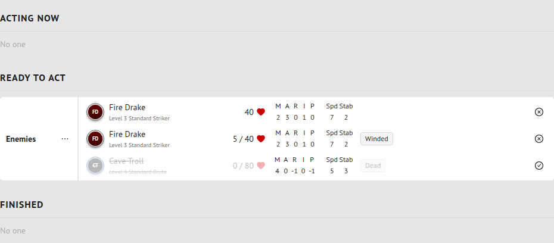
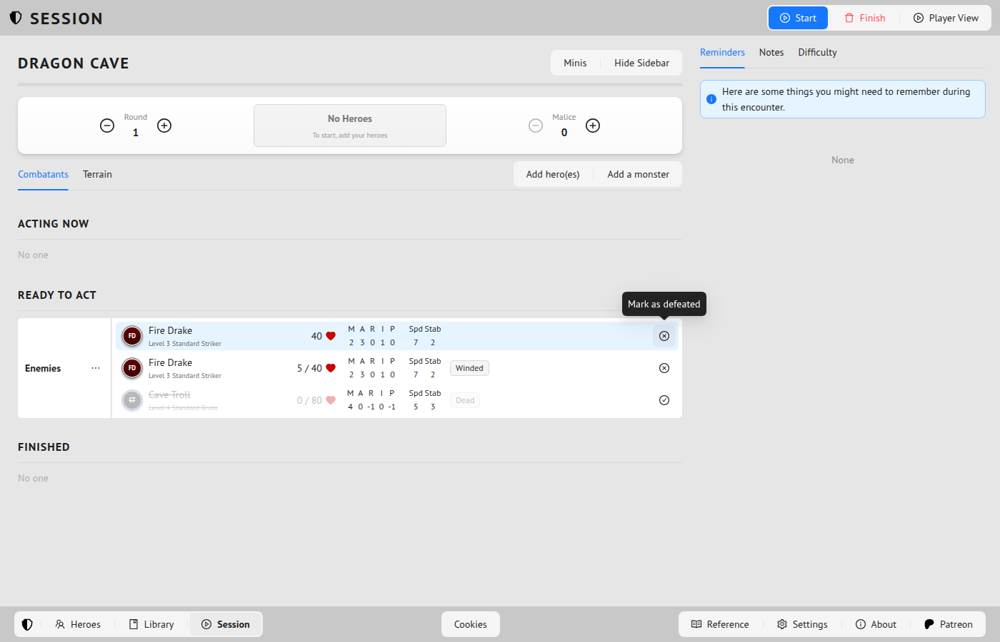
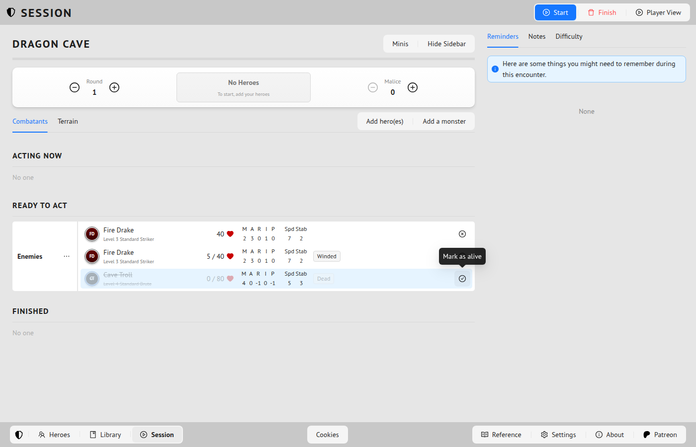

# Forge Steel — Fork Changes

This is a fork of [andyaiken/forgesteel](https://github.com/andyaiken/forgesteel). This file tracks changes made on top of the upstream repo.

## Hosted site

After merging to `main`, the app is automatically deployed to GitHub Pages:
**https://jahteo.github.io/forgesteel/**

---

## Changes

### Custom grouping and reordering for hero inventory, projects, titles, and features

**PR:** [#3](https://github.com/jahteo/forgesteel/pull/3) — `claude/reorderable-feature-lists-Sn7a8`

Players can now organize the lists they use during play — inventory, projects, titles, and the Features tab — into named, collapsible custom groups, making it easier to find things at the table. Items can be dragged to reorder within a group; groups can be dragged to reorder relative to each other. All customization persists in hero state and is fully backward-compatible with existing saves.

**How to test:**
1. Run `npx vite --host` and open http://localhost:5173
2. Load or create a hero, then open the **Inventory** button — confirm each item has a "No group" dropdown; type a new name and click **Create group "…"**
3. Assign a second item to the same group; drag the group header to reorder groups; click the header to collapse
4. Open **Projects** and **Titles** and repeat the above
5. On the **Features** tab, click `···` → set **Organize** to **Custom**; confirm all features show drag handles and group selectors; create a group, assign features, collapse the group, then switch back to Alphabetical — features return to sorted read-only view
6. Reload the page and confirm groups are still there

**Files changed:**
- `src/models/hero-state.ts` — `featureCustomization?: { id: string; group?: string }[]` added
- `src/models/item.ts` — `group?: string` added to `Item`
- `src/models/project.ts` — `group?: string` added to `Project`
- `src/models/title.ts` — `group?: string` added to `Title`
- `src/components/controls/grouped-item-list/grouped-item-list.tsx` — new generic `GroupedItemList<T>` component
- `src/components/controls/grouped-item-list/grouped-item-list.scss` — styles for group headers, indented items, create-group dropdown row
- `src/components/panels/hero/features/features-panel.tsx` — Custom organize mode using `GroupedItemList`; standard A-Z/Level/Source modes unchanged
- `src/components/panels/hero/hero-panel.tsx` — `onChangeHero?` prop added and threaded to `FeaturesPanel`
- `src/components/pages/heroes/hero-view/hero-view-page.tsx` — `changeHero` prop added and threaded to `HeroPanel`
- `src/components/main/main.tsx` — `persistHero` passed as `changeHero`
- `src/components/modals/hero-inventory/hero-inventory-modal.tsx` — uses `GroupedItemList`; feature-granted items shown in a separate read-only section
- `src/components/modals/hero-projects/hero-projects-modal.tsx` — uses `GroupedItemList`
- `src/components/modals/hero-titles/hero-titles-modal.tsx` — uses `GroupedItemList`

**Screenshots:**

| Before | After |
|--------|-------|
|  |  |
|  |  |


**Demo:**


**Upstream PR notes:** The `GroupedItemList` component and the model `group?` fields are generic and clean — good upstream candidates. The `featureCustomization` field in `HeroState` is also appropriate for upstream. The main upstream consideration is whether the upstream maintainer wants grouping in these player-facing lists; worth opening a discussion first before submitting. The sourcebook editors (class builder, etc.) are intentionally unchanged.

---

### Playwright screenshot tooling + PR screenshot requirements

**PR:** [#3](https://github.com/jahteo/forgesteel/pull/3) — `claude/playwright-screenshots-aThS7`

Adds a Playwright-based screenshot script so any developer or AI agent can capture the app at any route or element from the command line. Also establishes a hard requirement that every UI-touching PR includes before/after screenshots in its description, enforced via a PR template and documented in `CLAUDE.md`.

**How to test:**
1. Run `npx vite --host` (leave it running)
2. Take a screenshot: `npm run screenshot -- / screenshots/home.png`
3. Verify `screenshots/home.png` was created and shows the app

**Files changed:**
- `scripts/screenshot.ts` — CLI screenshot tool (route, output path, optional CSS selector)
- `playwright.config.ts` — Playwright config with Chromium auto-detection
- `package.json` — added `screenshot` script and `@playwright/test` / `tsx` dev deps
- `CLAUDE.md` — screenshot workflow docs and mandatory PR requirement
- `.github/pull_request_template.md` — pre-fills new PRs with a before/after screenshot table
- `screenshots/.gitkeep` — tracks the screenshots directory in git

**Upstream PR notes:** This is fork-specific infrastructure (the CLAUDE.md AI instructions, PR template with our repo URLs). The `playwright.config.ts` and `scripts/screenshot.ts` are generic and could be upstreamed, but are low priority for upstream since they add a dev dependency. Hold for now.

---

### One-click dead/alive toggle on monster rows

**PR:** [#1](https://github.com/jahteo/forgesteel/pull/1) — `claude/monster-dead-alive-toggle-Qa4Xa`

Adds a single-click toggle button to each monster row (and minion slot header) in the encounter run panel, so a GM can mark a monster as defeated or alive without opening the full health drawer.

- Alive monsters show a ✕ (`CloseCircleOutlined`) button — click to mark defeated
- Defeated monsters show a ✓ (`CheckCircleOutlined`) button — click to mark alive
- Defeated monsters display with a strikethrough name
- Defeating a non-captain cleans up any stale `captainID` references on minion slots
- Defeating a minion slot header marks all monsters in that slot as defeated

**Files changed:**
- `src/components/panels/encounter-group/encounter-group-panel.tsx` — toggle button UI and new `onToggleDefeated` / `onToggleMinionSlotDefeated` props
- `src/components/panels/run/encounter-run/encounter-run-panel.tsx` — `toggleMonsterDefeated` and `toggleMinionSlotDefeated` state handlers

**Screenshots:**





---

### GitHub Pages deployment

**Commit:** `fa42bc9`

Adds a GitHub Actions workflow (`.github/workflows/github-pages.yml`) that builds the Vite app and deploys it to GitHub Pages on every push to `main`. Also supports manual dispatch from any branch via the Actions tab.

- `vite.config.ts` sets `base: '/forgesteel/'` when `GITHUB_PAGES=true` (set by the workflow); local dev is unaffected
- To manually deploy before a PR is merged: **Actions → Deploy to GitHub Pages → Run workflow → select branch**

**One-time setup required:** In repo **Settings → Pages → Source**, select **GitHub Actions**.

---

## Running locally

```bash
git clone https://github.com/jahteo/forgesteel.git
cd forgesteel
npm install
npm run dev
```

App is available at `http://localhost:5173/`.
